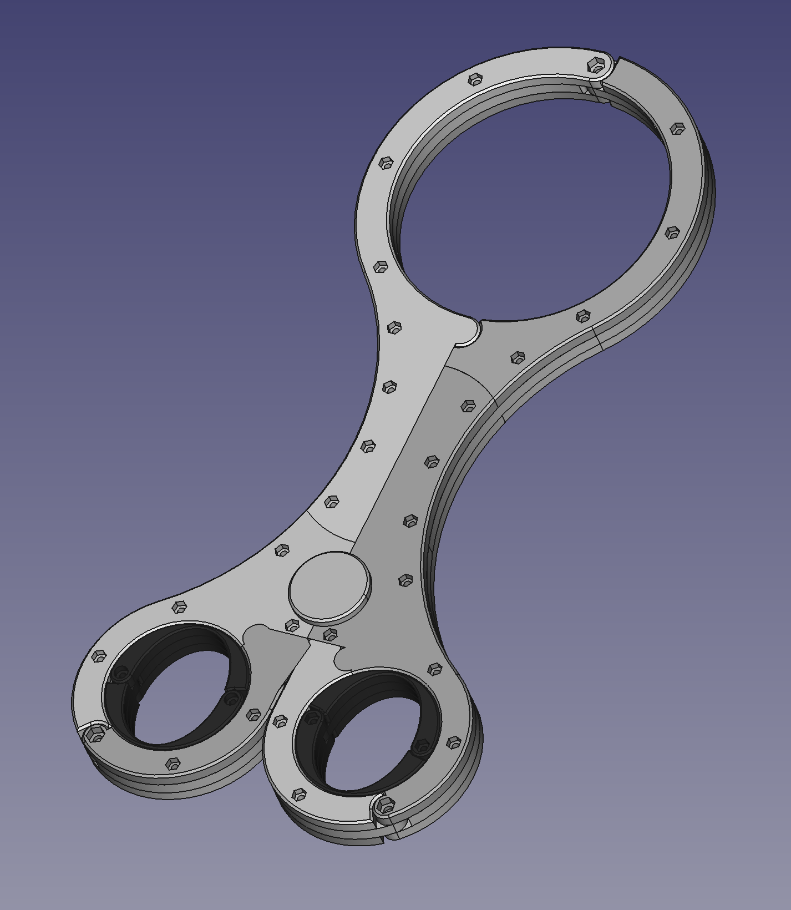
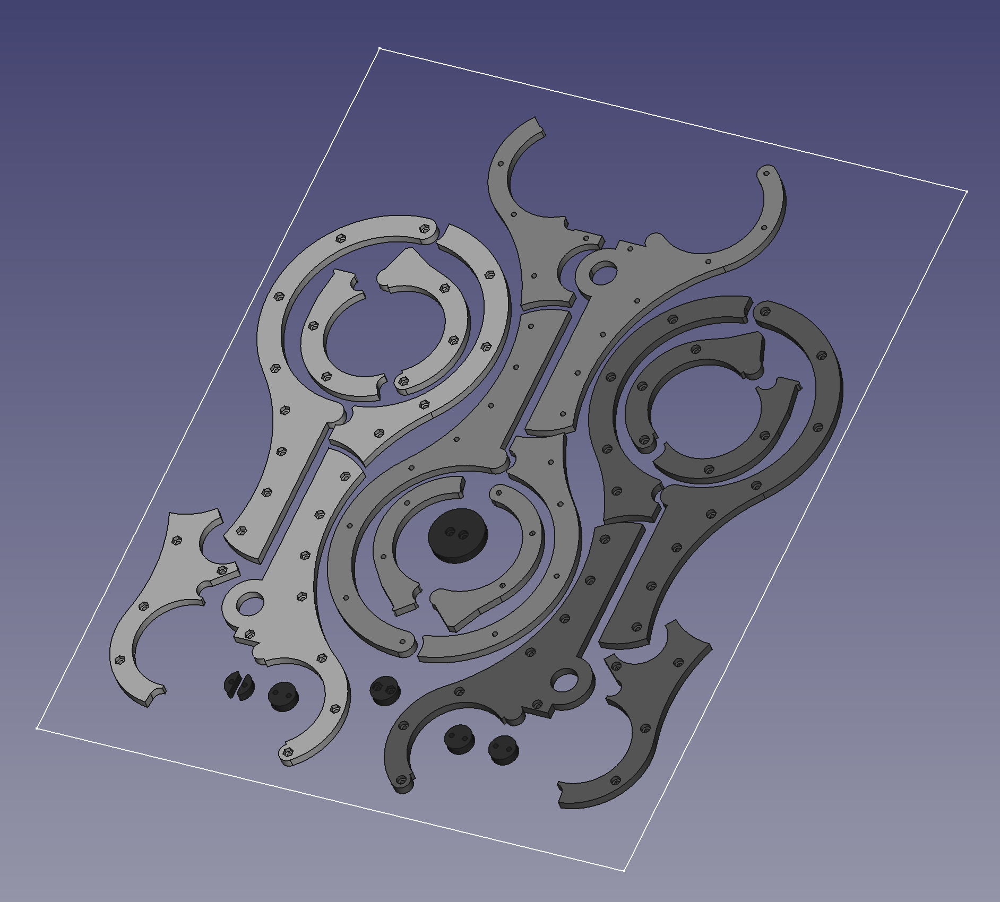

# BondageFiddle

这是一个用于BDSM目的的模型，用于拘束他人或者自我拘束。

特此警告⚠️：严禁将此模型用于强迫他人的目的。

## 关于尺寸

在正式制造之前，请先打印[Test.obj](./Output/Test.obj)模型确认尺寸匹配，若尺寸不合适，请打开[Fiddle.FCStd](./Fiddle.FCStd)，找到Reference部件，并编辑ReferenceSize草图，修改为适合的尺寸后重新导出对应模型。

## 制造说明

这个模型有两个版本，可以使用3D打印或用激光切割雕刻来制造。

### 3D打印

准备以下标准件：

| 名字                | 数量 |
| ------------------- | ---- |
| M3x14内六角杯头螺丝 | 30   |
| M3六角螺母          | 30   |
| M4x14内六角杯头螺丝 | 3    |
| M4六角螺母          | 3    |

使用PETG材料打印以下文件，参数使用100%填充，-0.1mm的XY外形尺寸补偿，0.1mm的XY孔洞尺寸补偿。

| 模型文件                                                      |
| ------------------------------------------------------------- |
| [Bolt](./Output/Bolt.obj)                                     |
| [Left-Arch-Primary-A](./Output/Left-Arch-Primary-A.obj)       |
| [Left-Arch-Primary-B](./Output/Left-Arch-Primary-B.obj)       |
| [Left-Arch-Secondary-A](./Output/Left-Arch-Secondary-A.obj)   |
| [Left-Arch-Secondary-B](./Output/Left-Arch-Secondary-B.obj)   |
| [Left-Clip-A](./Output/Left-Clip-A.obj)                       |
| [Left-Clip-B](./Output/Left-Clip-B.obj)                       |
| [Right-Arch-Primary-A](./Output/Right-Arch-Primary-A.obj)     |
| [Right-Arch-Primary-B](./Output/Right-Arch-Primary-B.obj)     |
| [Right-Arch-Secondary-A](./Output/Right-Arch-Secondary-A.obj) |
| [Right-Arch-Secondary-B](./Output/Right-Arch-Secondary-B.obj) |
| [Right-Clip-A](./Output/Right-Clip-A.obj)                     |
| [Right-Clip-B](./Output/Right-Clip-B.obj)                     |

使用TPU材料打印[Shackle](./Output/Shackle.obj)，参数使用100%填充，-0.1mm的XY外形尺寸补偿，0.1mm的XY孔洞尺寸补偿，数量4。

效果图：

### 激光切割

激光切割可以生产其中的大部分部件，但是少量部件依然需要3D打印TPU材料来制造。

准备以下标准件：

| 名字                | 数量 |
| ------------------- | ---- |
| M3x14内六角杯头螺丝 | 33   |
| M3x32内六角杯头螺丝 | 2    |
| M3六角螺母          | 35   |

准备一张 400x500x6(mm) 的亚克力板。

先以[LaserEngravingDraft.dxf](./Output/LaserEngravingDraft.dxf)填充后进行雕刻，雕刻深度为3mm左右。

保持坐标不动，再以[LaserCutDraft.dxf](./Output/LaserCutDraft.dxf)的外形线进行切割，即可完成。

使用TPU材料打印[ShackleForLaserCut](./Output/ShackleForLaserCut.obj)，参数使用100%填充，-0.1mm的XY外形尺寸补偿，0.1mm的XY孔洞尺寸补偿，数量4。

效果图：

## 感谢

本项目参考了[这个模型](https://www.printables.com/model/216352-bdsm-modern-self-bondage-fiddle-with-rotating-hand)，重新绘制后改善了该模型上一些尖锐的地方以及使之需要更少的支撑。
